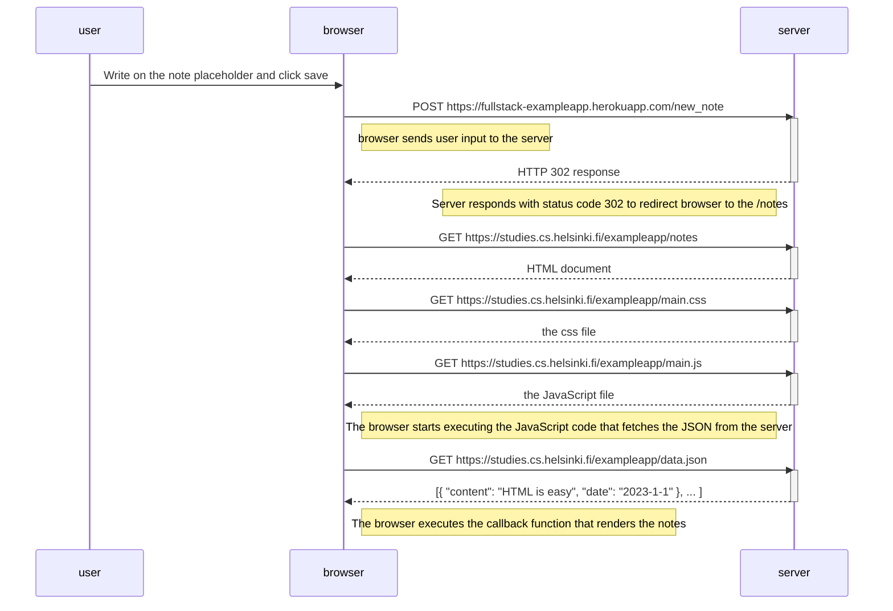

```mermaid

sequenceDiagram
    participant user
    participant browser
    participant server

    user->>browser: Write on the note placeholder and click save
    browser->>server: POST https://fullstack-exampleapp.herokuapp.com/new_note
   
    activate server
    Note right of browser: browser sends user input to the server
    server-->>browser: HTTP 302 response
    deactivate server
    Note left of server: Server responds with status code 302 to redirect browser to the /notes

    browser->>server: GET https://studies.cs.helsinki.fi/exampleapp/notes
    activate server
    server-->>browser: HTML document
    deactivate server

    browser->>server: GET https://studies.cs.helsinki.fi/exampleapp/main.css
    activate server
    server-->>browser: the css file
    deactivate server

    browser->>server: GET https://studies.cs.helsinki.fi/exampleapp/main.js
    activate server
    server-->>browser: the JavaScript file
    deactivate server

    Note right of browser: The browser starts executing the JavaScript code that fetches the JSON from the server

    browser->>server: GET https://studies.cs.helsinki.fi/exampleapp/data.json
    activate server
    server-->>browser: [{ "content": "HTML is easy", "date": "2023-1-1" }, ... ]
    deactivate server

    Note right of browser: The browser executes the callback function that renders the notes
```
