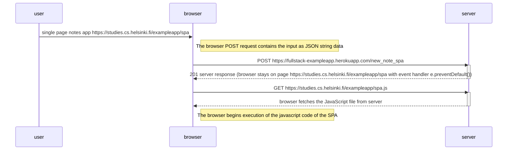

```mermaid
sequenceDiagram
    participant user
    participant browser
    participant server

    user->>browser: single page notes app https://studies.cs.helsinki.fi/exampleapp/spa 
    Note right of browser: The browser POST request contains the input as JSON string data
    browser->>server: POST https://fullstack-exampleapp.herokuapp.com/new_note_spa
    activate server
    server-->>browser: 201 server response (browser stays on page https://studies.cs.helsinki.fi/exampleapp/spa with event handler e.preventDefault())
    deactivate server

    

    browser->>server: GET https://studies.cs.helsinki.fi/exampleapp/spa.js
    activate server
    server-->>browser: browser fetches the JavaScript file from server
    deactivate server

    Note right of browser: The browser begins execution of the javascript code of the SPA


```